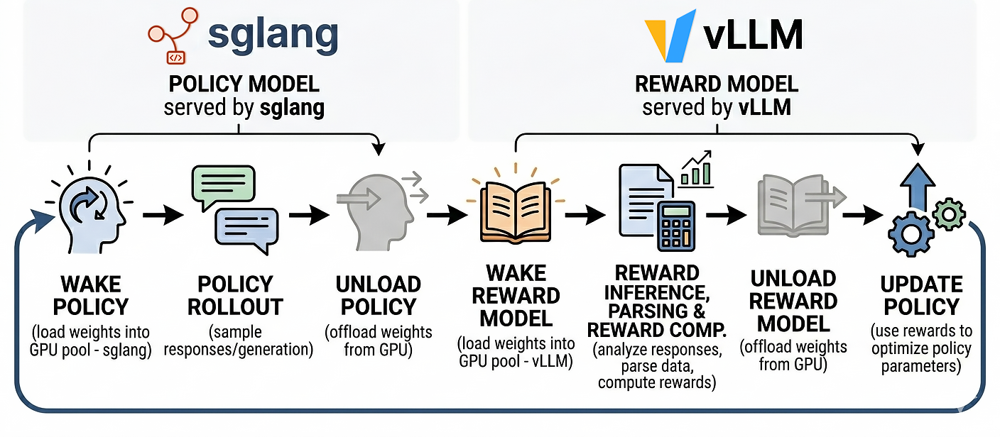

> [!IMPORTANT]
> Switch to `gen_rm` branch to use this fork.
> ```bash
> git checkout gen_rm
> ```

# Generative Reward Models Implementation for verl

This repository is a **fork of [verl](https://github.com/volcengine/verl)** that adds first-class support for **Generative Reward Models (GenRM)** in reinforcement learning, with extra features required by **GQM**-style groupwise evaluation for machine translation.

It is developed as the training backend for [**GRRM**](https://github.com/NJUNLP/GRRM), but the GenRM support is designed to be **generic and reusable**.

The original README file is available at [here](README_verl.md).

## Key Features

### 1) Shared GPU resource pool (Policy and Reward share the same cluster)
Policy model and reward model **contribute GPUs to one shared pool** and are scheduled dynamically.

- Parameters are automatically offloaded/unloaded when a model is idle
- The model is woken up (reloaded) only when needed
- Enables high utilization when running policy and reward in alternating phases

### 2) Generic Generative Reward Model support
This fork supports **any GenRM** (not only GRRM). You can plug in your own reward parsing logic via a **custom interface**:

- Take GenRM raw text / structured output
- Parse fields (e.g., scores, explanations)
- Convert them into scalar rewards used by RL (e.g., GRPO)

### 3) Group-consistent rollout dispatch (required by GRRM / GQM)
For group-based algorithms (e.g., GRPO) and groupwise reward evaluation (GQM), all candidates sampled from the same prompt must be sent to the same reward model instance.

This fork implements **group-aware dispatch** so that a rollout group are sent to the same reward model instance. To enable this feature, set `+reward_model.keep_group=True`.

### 4) MT reward post-processing hooks (GRRM for translation optimization)
Includes an implementation of a **translation-oriented reward post-processing module**, built on top of the generic GenRM interface:

- Parse GRRM / GenRM outputs for MT
- Compute final reward for optimization (e.g., handle formatting, invalid outputs, ties, normalization, etc.)


## Training Pipeline

The default execution flow alternates policy and reward to fit within limited GPU memory:



This design pairs naturally with the shared resource pool to maximize GPU utilization.


## Engine Setup

We use **two different serving backends**:

- **Policy model** is hosted by **sglang**
- **Reward model** is hosted by **vLLM**

Reason: a single Ray actor process cannot safely deploy **two model instances with the same engine backend** at the same time. Using different engines avoids conflicts and keeps deployment stable.


## Quick Use

### Config

To train with GenRM, the following key configurations are required:

```bash
ray job submit \
    --runtime-env=verl/trainer/runtime_env.yaml \
    --no-wait \
    -- \
    python3 -m \
    verl.trainer.main_ppo \
    actor_rollout_ref.rollout.name=sglang \ # Use sglang as the inference engine for the policy model
    reward_model.enable=True \ # Enable reward model and set strategy to GenRM
    reward_model.strategy=GenRM \
    reward_model.model.path=path/to/your_GenRM \
    +reward_model.rollout.name=vllm \ # Use vLLM as the inference engine for the reward model
    +reward_model.custom_processor.path=path/to/custom_processor_python_file \ # Configure custom processor
    +reward_model.custom_processor.name=custom_processor_name \
    custom_reward_function.path=reward_utils/rm_lib.py \ # Configure custom reward function (not used in GenRM, but required by verl)
    custom_reward_function.name=score_reward_fn \ # a void reward function, always returns 0
    ...
```

### Custom Processor Interface Definition

Custom processors need to implement the following interface:

```python
class YourCustomProcessor:
    def __init__(self, *args, **kwargs):
        # Initialize configuration
        self.config = kwargs.get("config")
        self.tokenizer = kwargs.get("tokenizer", None)
        self.input_tokenizer = kwargs.get("input_tokenizer", self.tokenizer)
        # Other initialization...

    def compute_scores(self, data, generate_fn):
        # Core method: process data and compute reward scores
        # data: DataProto type, containing batch data
        # generate_fn: generation function to call GenRM
        # Returns: list of reward scores
        prompts = self.process_input(data)
        outputs = generate_fn(prompts)
        return self.process_output(outputs)

    def process_input(self, data) -> list[dict]:
        # Preprocess input data, construct and tokenize prompts for GenRM
        # Returns: list of prompt dictionaries, each with "prompt_token_ids" key
        pass

    def process_output(self, outputs) -> list[float]:
        # Process GenRM outputs, extract and compute final rewards
        # Returns: list of final reward scores
        pass
```

This repository provides several built-in processor examples (`reward_utils/rm_lib.py`):
- `RewardModelProcessor`: single candidate evaluation for common generative reward models
- `GroupRewardModelProcessor`: multi-candidate group comparison evaluation for GRRM.
- `VHeadRewardModelProcessor`: Bradley-Terry reward model (set `reward_model.strategy=vheadRM`)

> [!NOTE]
> Set `+reward_model.keep_group=True` to enable group-aware dispatch for GRRM.

### Custom Processor Arguments

You can pass custom arguments to your processor via the command line:
```bash
ray job submit \
    --runtime-env=verl/trainer/runtime_env.yaml \
    --no-wait \
    -- \
    python3 -m \
    verl.trainer.main_ppo \
    +reward_model.custom_processor.arg1=arg1_value \
    +reward_model.arg2=arg2_value \
    ...
```

```python
class YourCustomProcessor:
    def __init__(self, *args, **kwargs):
        # Initialize configuration
        self.config = kwargs.get("config")
        self.tokenizer = kwargs.get("tokenizer", None)
        self.input_tokenizer = kwargs.get("input_tokenizer", self.tokenizer)
        
        arg1 = self.config.custom_processor.get('arg1', None)
        arg2 = getattr(self.config, "arg2", None)

```

### Reward Model Rollout Config

Advanced configurations for reward model rollout:

```bash
ray job submit \
    --runtime-env=verl/trainer/runtime_env.yaml \
    --no-wait \
    -- \
    python3 -m \
    verl.trainer.main_ppo \
    +reward_model.rollout.free_cache_engine=True \
    +reward_model.rollout.name=vllm \ # do not change
    +reward_model.rollout.mode=sync \ # not tested for async mode
    +reward_model.rollout.gpu_memory_utilization=0.6 \
    +reward_model.rollout.tensor_model_parallel_size=1 \
    +reward_model.rollout.max_num_batched_tokens=12000 \
    +reward_model.rollout.temperature=0 \
    +reward_model.rollout.top_p=1 \
    +reward_model.rollout.top_k=-1 \
    +reward_model.rollout.response_length=8192 \
    ...
```


## Relation to GRRM

GRRM is one instantiation of GenRM under the **Group Quality Metric (GQM)** paradigm. This fork provides the infrastructure needed to run GRRM efficiently inside GRPO/RLVR loops:

- groupwise evaluation dispatch
- robust reward parsing for MT optimization
- shared resource scheduling for policy abd reward inference

## Acknowledgement

This codebase is based on **verl**. We thank the original authors and contributors.


## Citation
```bibtex
@misc{yang2026grrmgrouprelativereward,
      title={GRRM: Group Relative Reward Modeling for Machine Translation}, 
      author={Sen Yang and Shanbo Cheng and Lu Xu and Jianbing Zhang and Shujian Huang},
      year={2026},
      eprint={2602.14028},
      archivePrefix={arXiv},
      primaryClass={cs.CL},
      url={https://arxiv.org/abs/2602.14028},
}
```
